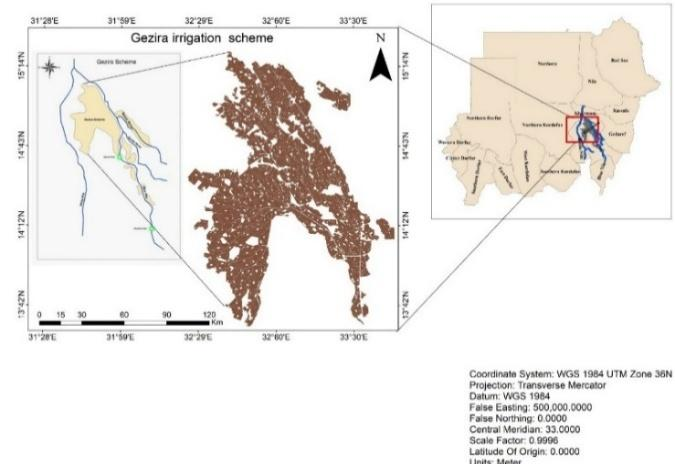
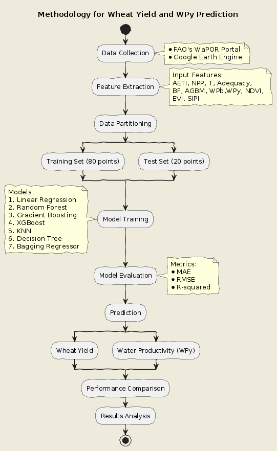

# WheatML-Precision-Agriculture-Analysis-Suite
Advanced ML application for predicting wheat yield &amp; water productivity using remote sensing data. Features real-time predictions, interactive visualizations, and multi-model analysis. MSc project integrating precision agriculture with machine learning for Sudan's Gezira Irrigation Scheme, 2024.

# 🌾 WheatML: Precision Agriculture Analysis Suite

Advanced machine learning application for predicting wheat yield and water productivity in Sudan's Gezira Irrigation Scheme using remote sensing data.

- 🎯 Multi-Model Prediction Engine
- 💧 Water Resource Optimization
- 📊 Interactive Data Visualization
- 🛰️ Remote Sensing Integration
- 🌟 Feature Importance Analysis

## 🎯 Key Features
- Multi-model prediction engine (RF, XGBoost, GBM, etc.)
- Real-time yield and water productivity forecasting
- Interactive data visualization dashboard
- Feature importance analysis
- Performance metrics comparison
- Secure login system

## 💻 Tech Stack
- Python 3.10 - scikit-learn - XGBoost - TensorFlow - Pandas/NumPy - Matplotlib/Seaborn - tkinter/ttkbootstrap

## 📊 Models
- Linear Regression - Random Forest - Gradient Boosting - XGBoost - KNN - Decision Tree - Bagging Regressor

_**# Location of Study Area (Gezira Irrigation Scheme)**_

_**# Methodology for Wheat Yield and WPy Prediction Using Machine Learning**_

📝 Usage
Launch application
Login credentials:
* Username: HRC_Sudan
* Password: 422436

📄 License
* **© 2024 KTU & HRC Sudan. All rights reserved.**
